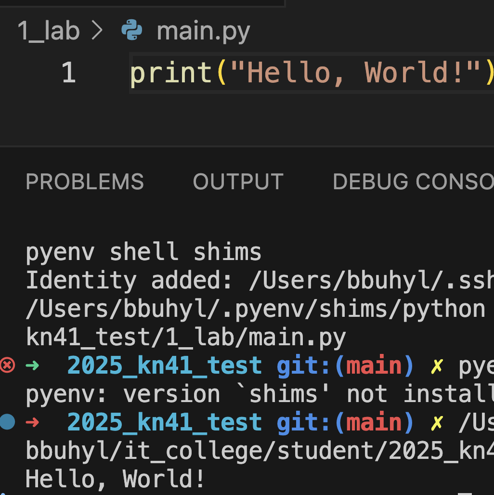
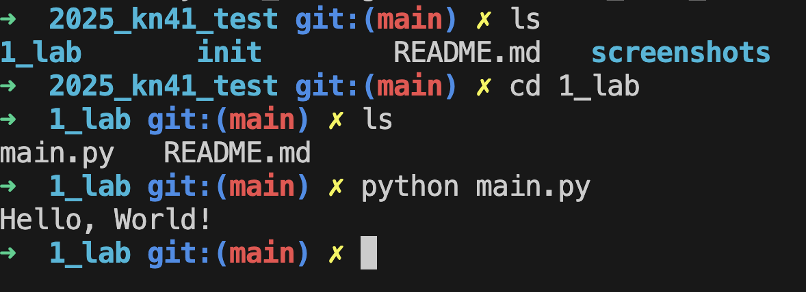

# Звіт до роботи
## Тема: _Вступні заняття: Оформлення та здача робіт, та перша програма_
### Мета роботи: _Налаштувати середовище для роботи з Python, створити репозиторій Github, створити інтеграцію з Visual Studio Code, написати першу програму та оформити звіт з використанням Markdown_

---
### Виконання роботи
* Результати виконання завданнь:
    1. Створили репозиторій та почали працювати з ним;
    1. Згідно інструкцій створили першу програму та запустили її:
        - запуск з Visual Studio Code 
        - запустили з консолі 
    1. модифікував змінні у програмі:
        ```python
        name = "Богдан"
        ``` 
    1. Створили Jupyter Notebook та написали першу програму в комірці [файл Notebook](nb.ipynb)
        - Всі комірки виконались
    1. Запитались у АІ про першу програму та отримали:
        ```python
        print("Hello, World!")
        ```
    1. Навчились запускати програми на python та працювати з Jupyter Notebook;

* виконали всі інструкції по роботі та доробили звіт;

---
### Висновок:
> у висновку потрібно відповісти на запитання:

- :question: Що зроблено в роботі;
- :question: Чи досягнуто мети роботи;
- :question: Які нові знання отримано;
- :question: Чи вдалось відповісти на всі питання задані в ході роботи;
- :question: Чи вдалося виконати всі завдання;
- :question: Чи виникли складності у виконанні завдання;
- :question: Чи подобається такий формат здачі роботи (Feedback);
- :question: Побажання для покращення ( :pray: Suggestions);

---