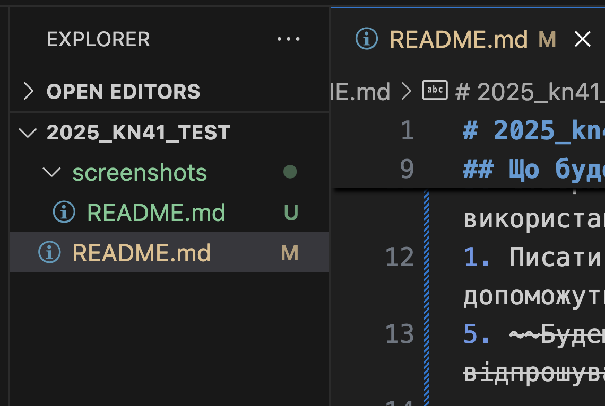

__*Вівторок*__

**Середа**

## Що будемо вчити?
2. вчитись програмувати з використанням ООП;
3. Створювати програми з використанням можливостей АІ;
1. Писати програми які допоможуть в навчанні;
5. ~~Будемо байдикувати та відпрошуватись~~

## Додаткові джерела
[Документація по роботи з Markdown](https://code.visualstudio.com/docs/languages/markdown)

- [Перехід у папку з скріншотами](../screenshots/README.md)

1. Приклад вставки скріншота


1. Приклад вставки коду
```python
print("Hello")